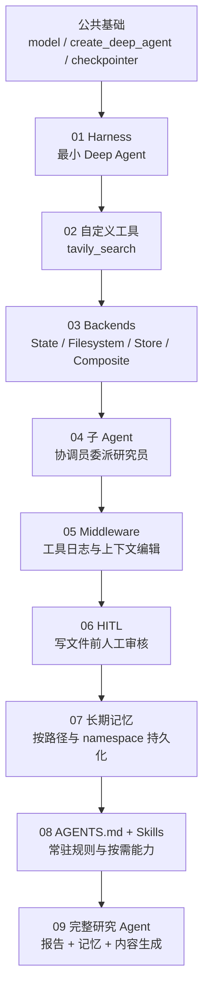
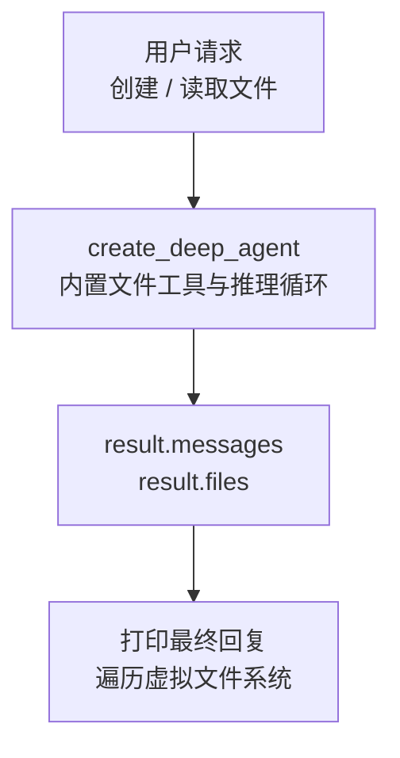
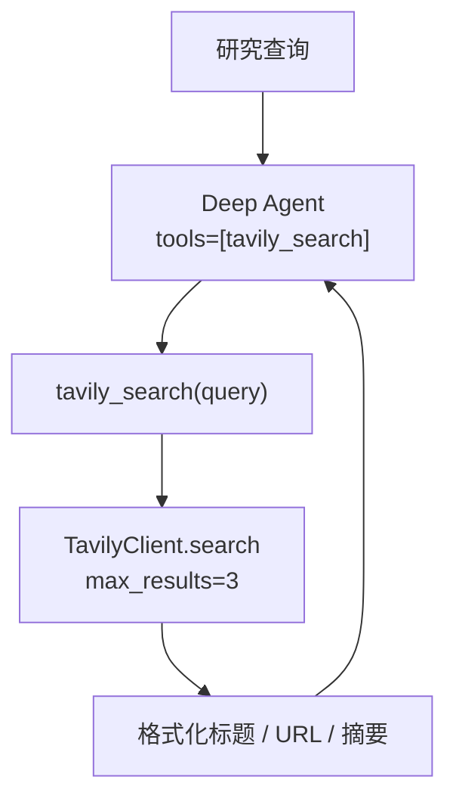
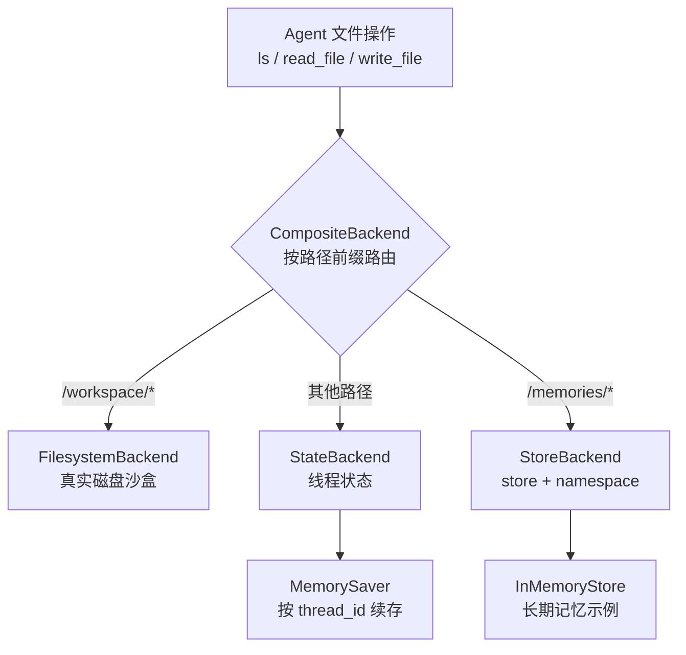
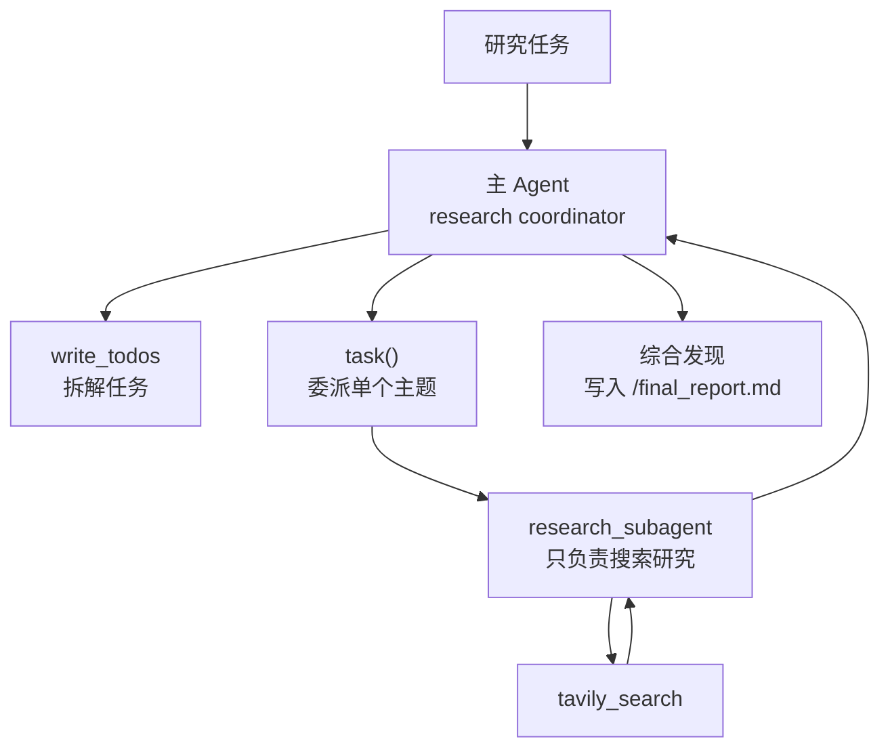
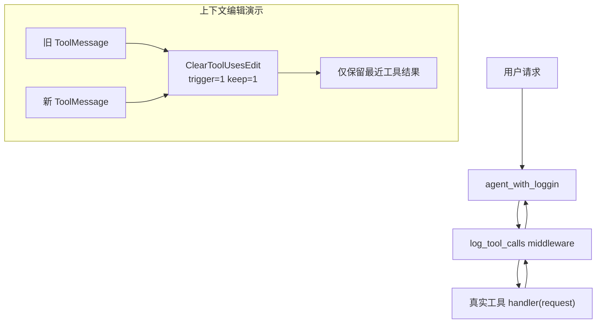
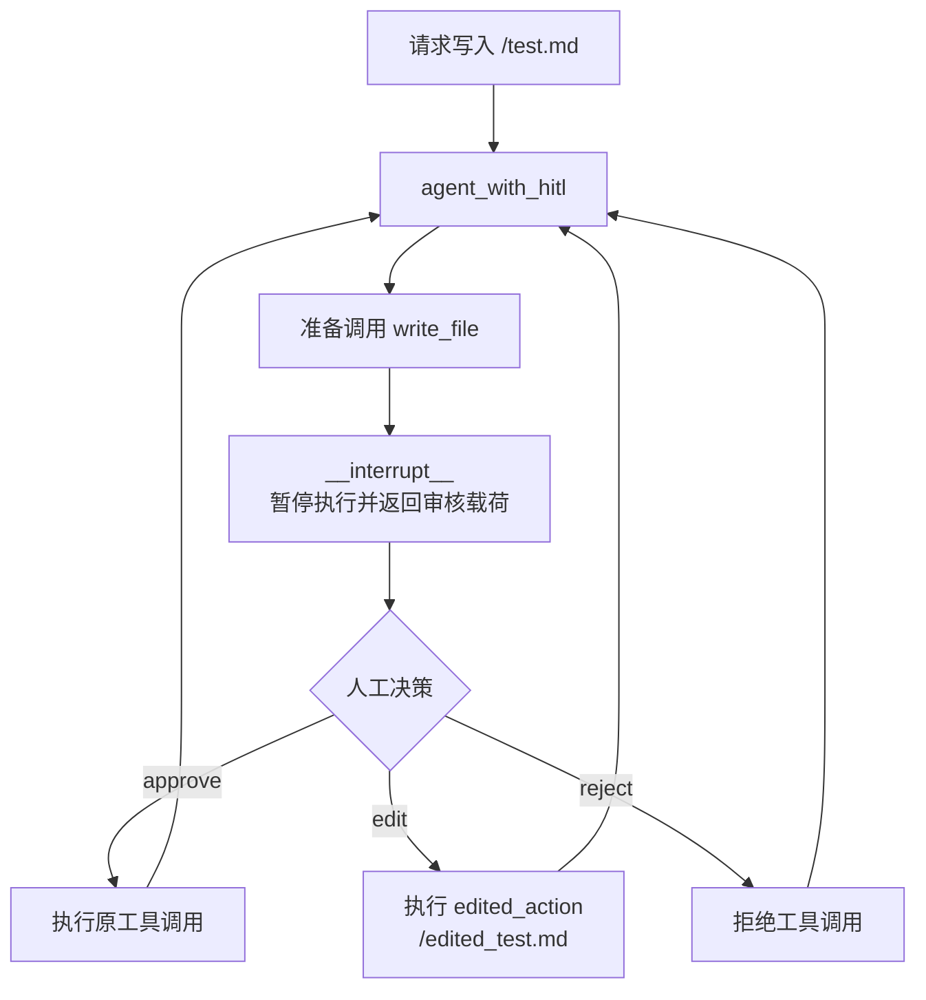
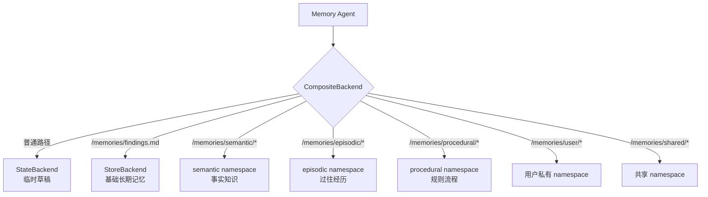
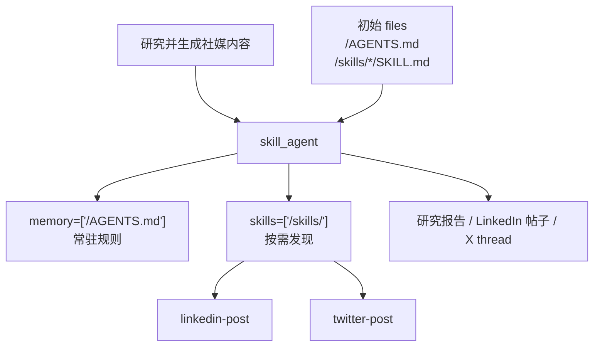
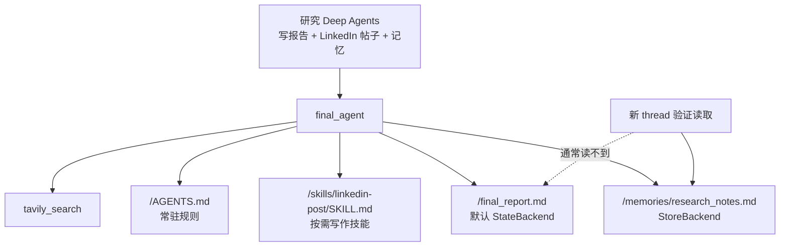

# deep_agents.py 技术知识点总结

> 一个围绕 LangChain Deep Agents 的进阶教学脚本：从最小可用
> `create_deep_agent` 出发，逐步叠加自定义工具、Backend 路由、子 Agent、
> middleware、Human-in-the-Loop、长期记忆、AGENTS.md 与 Skills。
> 全文共 9 个部分，前半段讲运行机制，后半段讲工程化组合。

---

## 目录

- [全局架构总览](#全局架构总览)
- [第 01 部分：Harness 最小 Deep Agent](#第-01-部分harness-最小-deep-agent)
- [第 02 部分：自定义工具与 Tavily 搜索](#第-02-部分自定义工具与-tavily-搜索)
- [第 03 部分：Backends 与文件系统路由](#第-03-部分backends-与文件系统路由)
- [第 04 部分：子 Agent 研究委派](#第-04-部分子-agent-研究委派)
- [第 05 部分：Middleware 与上下文编辑](#第-05-部分middleware-与上下文编辑)
- [第 06 部分：Human-in-the-Loop 工具审核](#第-06-部分human-in-the-loop-工具审核)
- [第 07 部分：Long-term Memory 长期记忆](#第-07-部分long-term-memory-长期记忆)
- [第 08 部分：AGENTS.md 与 Skills](#第-08-部分agentsmd-与-skills)
- [第 09 部分：完整研究 Agent](#第-09-部分完整研究-agent)
- [总结：设计主线与工程要点](#总结设计主线与工程要点)

---

## 全局架构总览

这个脚本不是手写 `StateGraph`，而是使用 `create_deep_agent` 作为高级封装。
它把 Deep Agents 的关键能力拆成 9 个教学切片：先建立 Agent，再让 Agent
拥有搜索、文件系统、子任务、日志、人工审核、长期记忆和按需技能。



### 贯穿全文的核心组件

| 组件 | 代码位置 | 作用 |
| --- | --- | --- |
| `model` | 第 36 行 | 统一从 `utils.models` 导入模型，避免在业务脚本硬编码 API 配置。 |
| `create_deep_agent` | 第 9、42、269、315、388、510、539 行 | Deep Agents 的核心入口，封装 ReAct 循环、文件工具、todo、子 Agent 等能力。 |
| `tavily_search` | 第 88-110 行 | 自定义搜索工具，作为研究 Agent 和子 Agent 的外部信息入口。 |
| `checkpointer` | 第 143 行 | 使用 `MemorySaver` 保存线程状态，支撑跨 invoke 的短期状态与中断恢复。 |
| `CompositeBackend` | 第 262-267、316-326 行 | 按文件路径前缀分流到不同 Backend，让 Agent 用统一文件接口访问不同存储。 |
| `StoreBackend` | 第 319-327、620、684-686、759-761、989-995 行 | 把 `/memories/` 等路径映射到 `store`，用于长期记忆与 namespace 隔离。 |
| `research_subagent` | 第 361-367 行 | 用字典声明子 Agent 的名称、描述、系统提示词与工具。 |
| `wrap_tool_call` | 第 452-462 行 | 包装工具调用，实现横切日志能力。 |
| `interrupt_on` + `Command` | 第 547-550、588-605 行 | 对敏感工具调用进行人工审核，并用 `Command(resume=...)` 恢复执行。 |
| `memory` / `skills` | 第 923-924、1004-1005 行 | 让 Agent 自动加载常驻上下文与按需技能文件。 |

### State 设计（关键）

`deep_agents.py` 没有显式定义 `TypedDict State`。这是本脚本的重要教学点：
`create_deep_agent` 隐藏了底层图状态，调用者主要观察返回的状态字段。

```python
result = agent.invoke(
    {"messages": [{"role": "user", "content": "..."}]},
    config={"configurable": {"thread_id": uuid7()}},
)

# 外部可观察的关键状态形态
{
    "messages": [...],        # 对话消息，底层按消息 reducer 追加
    "files": {...},           # Agent 文件系统视图，具体落点由 backend 决定
    "todos": [...],           # Deep Agents 内置任务列表
    "__interrupt__": (...),   # HITL 中断载荷
}
```

这里的核心不是「手写 reducer」，而是理解封装后的状态边界：
`messages` 仍然是 Agent 推理循环的主轴，`files` 是否跨轮保留取决于
`backend` 与 `checkpointer`，`__interrupt__` 则依赖 `checkpointer` 保存现场。

---

## 第 01 部分：Harness 最小 Deep Agent

> 对应代码：第 38-70 行

### 知识点

1. **最小 Deep Agent 只需要模型与提示词**（第 42-45 行）。
   `create_deep_agent(model=model, system_prompt=...)` 会自动装配基础 Agent
   能力，脚本不需要手写 `StateGraph`、`ToolNode` 或条件边。这里的目的不是展示
   全部能力，而是先建立「Deep Agent 是更高层封装」这个心智模型。
2. **系统提示词直接约束输出语言与路径格式**（第 44 行）。文件路径要求使用
   反引号而不是 Markdown 链接，是后续文件读写演示的铺垫：Agent 需要把路径当
   可复制的工程对象，而不是渲染后的链接。
3. **注释块展示虚拟文件系统返回形态**（第 48-70 行）。`result.get("files", {})`
   说明 Deep Agents 会把文件系统作为状态的一部分返回，初学者可以直接打印文件
   路径与内容验证工具行为。



### 业务流程

这一段的理想执行路径是：用户要求创建 `notes.md`，Agent 调用内置文件工具写入
内容，再读取文件确认，最后从 `result["messages"]` 和 `result["files"]` 两个视角
验证「回答」与「文件状态」是否一致。

---

## 第 02 部分：自定义工具与 Tavily 搜索

> 对应代码：第 72-136 行

### 知识点

1. **工具客户端单独封装**（第 76-84 行）。`_create_tavily_client()` 先读取
   `TAVILY_API_KEY`，缺失时抛出 `RuntimeError`。这样做比让 Tavily 进入匿名
   keyless 模式更适合教学，因为失败原因明确，不会让限流错误干扰核心知识点。
2. **`@tool(parse_docstring=True)` 让 docstring 进入工具 schema**（第 88-97 行）。
   `Args:` 与 `Returns:` 写得越清楚，模型越容易判断何时调用 `tavily_search`，
   以及应该传入怎样的 `query`。
3. **工具返回面向 LLM 的摘要文本**（第 98-110 行）。函数没有把 Tavily 原始 JSON
   原样丢给模型，而是提取 `title`、`url`、`content` 拼成 Markdown 片段，降低
   后续综合报告时的解析负担。
4. **Agent 接入工具只需传 `tools=[tavily_search]`**（第 113-120 行）。这与第
   01 部分形成对比：Deep Agent 的底层循环不变，只是工具箱变大。



### 可疑点

第 110 行返回字符串写成 `Found{len(result_texts)} result(s) for 'query'`，
这里的 `'query'` 是字面量，不会显示真实查询内容。若要用于教学验证，建议改成
`for {query!r}`，否则日志看起来像查询参数丢失。

---

## 第 03 部分：Backends 与文件系统路由

> 对应代码：第 139-332 行

### 知识点

1. **`MemorySaver` 是 StateBackend 的续命条件**（第 143-183 行）。
   注释示例用同一个 `thread_id` 先写 `/research_notes.md` 再读它，意图是说明：
   `StateBackend` 把文件放在图状态里，`checkpointer` 负责让这份状态跨 invoke
   留下来，`thread_id` 决定读哪份状态。
2. **`FilesystemBackend` 把文件落到真实磁盘沙盒**（第 203-251 行）。
   `FilesystemBackend(root_dir=sandbox_dir, virtual_mode=True)` 让 Agent 看到虚拟
   根目录 `/`，实际文件被映射到 `sandbox_dir` 下，既能验证落盘，又能避免 Agent
   访问系统任意路径。
3. **`CompositeBackend` 用路径前缀做分流**（第 256-281 行）。
   `/workspace/*` 命中 `FilesystemBackend`，其他路径走 `StateBackend()`。这个设计
   把「文件该存哪里」从 prompt 和业务逻辑里移走，交给 Backend 路由统一处理。
4. **`StoreBackend` 把文件接口变成长期记忆接口**（第 313-327 行）。
   `/memories/` 路由到 `StoreBackend`，并通过 `namespace` 固定到
   `("deep_agents", "basic_memory", "memories")`。同样是 `write_file`，路径不同，
   背后的持久化语义完全不同。
5. **临时目录清理是演示脚本的收尾动作**（第 330-332 行）。
   `shutil.rmtree(..., ignore_errors=True)` 避免本地反复运行后留下沙盒目录。



### 后端对比

| 维度 | `StateBackend` | `FilesystemBackend` | `StoreBackend` | `CompositeBackend` |
| --- | --- | --- | --- | --- |
| 主要用途 | 临时文件、线程状态 | 落盘文件、沙盒工作区 | 长期记忆 | 混合路由 |
| 隔离键 | `thread_id` | `root_dir` | `namespace` | 路径前缀 |
| 是否需要 `store` | 不需要 | 不需要 | 需要 | 取决于子后端 |
| 教学重点 | checkpointer 保存状态 | `virtual_mode=True` 防越界 | 记忆命名空间 | 路由解耦 |

### 可疑点

第 205、258 行使用 `tempfile.mktemp()`，该 API 存在竞态风险。教学脚本里问题不大，
生产代码应优先使用 `tempfile.TemporaryDirectory()` 或 `NamedTemporaryFile()`。

---

## 第 04 部分：子 Agent 研究委派

> 对应代码：第 334-414 行

### 知识点

1. **子 Agent 用普通字典声明**（第 361-367 行）。
   `name` 是调用标识，`description` 帮主 Agent 判断何时委派，`system_prompt`
   定义子 Agent 行为边界，`tools` 决定子 Agent 能力范围。
2. **研究员提示词包含日期、任务、硬性限制与输出格式**（第 337-359 行）。
   这不是装饰性 prompt，而是在减少搜索滥用、保证引用格式、让结果便于主 Agent
   综合。Deep Agents 里子 Agent 越自治，边界越需要写清楚。
3. **协调员被禁止直接搜索**（第 377-385 行）。
   `ORCHESTRATOR_INSTRUCTIONS` 明确要求使用 `write_todos` 规划，再通过 `task()`
   委派给子 Agent。这个约束把主 Agent 从「执行者」变成「规划者和综合者」。
4. **`subagents=[research_subagent]` 是委派能力开关**（第 388-394 行）。
   一旦传入子 Agent，Deep Agent 会暴露任务委派能力，主 Agent 可以把研究子问题
   交给更窄职责的 Agent。



### 业务流程

用户给出一个宽泛研究主题，主 Agent 先拆任务，不直接搜索；每个子主题交给
`research_subagent`，子 Agent 调 `tavily_search` 获取信息，再把带引用的发现返回
给主 Agent，由主 Agent 汇总成最终报告。

---

## 第 05 部分：Middleware 与上下文编辑

> 对应代码：第 419-532 行

### 知识点

1. **脚本先真实调用一次带子 Agent 的 `agent`**（第 422-448 行）。
   请求内容是创建调研机器学习框架的计划，随后读取 `result["todos"]`。这说明
   Deep Agents 的 todo 列表不是普通文本，而是可从状态中单独取出的结构化字段。
2. **`@wrap_tool_call` 实现工具调用日志**（第 451-462 行）。
   middleware 拿到 `request.tool_call["name"]` 与 `args`，调用 `handler(request)`
   执行真实工具，再打印完成日志。这类横切逻辑不应该塞进每个工具函数里。
3. **`ClearToolUsesEdit` 演示上下文裁剪**（第 466-508 行）。
   代码构造两组 `AIMessage` + `ToolMessage`，然后用
   `ClearToolUsesEdit(trigger=1, keep=1)` 保留最近一次工具结果。它解决的是长期
   研究中工具结果过长、上下文膨胀的问题。
4. **middleware 通过 `middleware=[log_tool_calls]` 注入 Agent**（第 510-516 行）。
   Agent 行为本身不变，只是在工具调用前后增加观测能力，适合调试和审计。



### 可疑点

- 第 424-434、520-528 行会真实调用模型；如果 `.env` 或网络不可用，脚本运行会卡在
  这一段，而不是只做静态演示。
- 第 510 行变量名写作 `agent_with_loggin`，应为 `agent_with_logging` 更清晰。
- 第 493 行 `isinstance(message,ToolMessage)` 少了逗号后的空格，是轻微风格问题。

---

## 第 06 部分：Human-in-the-Loop 工具审核

> 对应代码：第 535-608 行

### 知识点

1. **`interrupt_on` 把敏感工具变成人工审核点**（第 539-550 行）。
   `write_file` 和 `edit_file` 被配置为可 `approve`、`edit`、`reject`。这比在 prompt
   里要求「谨慎写文件」更可靠，因为它把控制权放在图执行层。
2. **第一次 invoke 只推进到中断点**（第 553-569 行）。
   用户请求写 `/test.md`，Agent 一旦准备调用 `write_file`，返回结果中会带
   `__interrupt__`，而不是直接落盘。
3. **中断载荷包含工具调用与审核配置**（第 571-580 行）。
   `action_requests` 说明 Agent 想调用什么工具、参数是什么；`review_configs`
   说明人类允许做哪些决策。UI 或 CLI 可以直接基于这两个字段生成审核界面。
4. **`Command(resume=...)` 恢复并改写工具参数**（第 588-605 行）。
   示例选择 `"type": "edit"`，把路径改为 `/edited_test.md`，内容改为
   `Hello from edited HITL decision`。这展示的是「人类不是只批准或拒绝，还能修正
   Agent 的动作」。



### 业务流程

这一段把文件写入作为风险动作处理：模型可以提出工具调用，但实际执行前必须经过
人类确认。工程上这适合发送邮件、写数据库、改文件、下单等不可轻易回滚的场景。

---

## 第 07 部分：Long-term Memory 长期记忆

> 对应代码：第 611-823 行

### 知识点

1. **最小长期记忆是 `/memories/` + `StoreBackend`**（第 615-640 行）。
   `CompositeBackend(default=StateBackend(), routes={"/memories/": StoreBackend()})`
   让普通文件保持临时，而 `/memories/*` 进入 `store`，从而跨 thread 保留。
2. **提示词必须教 Agent 主动读记忆**（第 628-635 行）。
   仅有 `StoreBackend` 不代表模型会自动知道该读什么；prompt 明确要求被问到
   「记得什么」时先 `ls` 和 `read_file` 检查 `/memories/`。
3. **跨线程验证长期记忆**（第 646-675 行）。
   线程 1 写 `/memories/findings.md`，线程 2 读取同一路径。这个对照说明长期记忆
   的隔离维度不是 `thread_id`，而是 `store` 与 `namespace`。
4. **按记忆类型拆 namespace**（第 678-714 行）。
   `/memories/semantic/`、`/memories/episodic/`、`/memories/procedural/`
   分别对应事实、经历、规则。路径结构让 Agent 在写入前先做信息分类。
5. **按用户作用域拆 namespace**（第 753-784 行）。
   `/memories/user/` 使用 `runtime.context.user_id` 进入用户私有 namespace，
   `/memories/shared/` 使用共享 namespace。它解决的是多用户场景下「个人偏好」
   与「团队规范」不能混存的问题。



### 记忆类型对比

| 记忆类型 | 路径前缀 | 适合保存 | 为什么要分开 |
| --- | --- | --- | --- |
| Semantic | `/memories/semantic/` | 用户偏好、项目事实 | 便于长期检索稳定事实。 |
| Episodic | `/memories/episodic/` | 会话摘要、历史交互 | 保留「发生过什么」而不是抽象规则。 |
| Procedural | `/memories/procedural/` | 写作规范、报告流程 | 让 Agent 复用操作方法。 |
| User scoped | `/memories/user/` | 单个用户私有偏好 | 防止 Bob 读到 Alice 的私人记忆。 |
| Shared scoped | `/memories/shared/` | 团队规范、公共知识 | 所有用户都应该可见。 |

### 可疑点

第 760 行在注释块里使用 `getattr(rt.context, "user_id", "default")`。
如果实际运行时 `runtime.context` 是字典而不是对象属性，这里可能取不到用户 ID。
更稳妥的写法需要根据 deepagents 运行时对象确认，例如使用项目当前版本推荐的
context 读取方式。

---

## 第 08 部分：AGENTS.md 与 Skills

> 对应代码：第 827-975 行

### 知识点

1. **`AGENTS.md` 表达常驻工作规则**（第 831-850 行）。
   内容定义研究助理的工作流程：规划、研究、反思、综合、撰写、记录。它适合放
   每次任务都要遵循的长期指令，而不是某一种特定产物的模板。
2. **Skills 表达按需能力**（第 855-911 行）。
   `linkedin-post` 和 `twitter-post` 都有 frontmatter 的 `name` 与
   `description`，再写具体格式、语气、篇幅。`description` 的作用是让 Agent
   判断用户意图是否匹配该 skill。
3. **`memory=["/AGENTS.md"]` 与 `skills=["/skills/"]` 分工不同**（第 919-928 行）。
   前者是常驻加载，后者是按需发现。这样能避免每次对话都把所有社媒写作规范塞进
   上下文，同时仍保留按需扩展能力。
4. **把规则文件放入虚拟文件系统**（第 930-954 行）。
   `skill_files` 把 `/AGENTS.md`、`/skills/linkedin-post/SKILL.md`、
   `/skills/twitter-post/SKILL.md` 作为初始 `files` 传给 Agent。Agent 随后可以
   根据任务读取常驻规则和相关 skill。



### 可疑点

第 932-934 行引用 `create_file_data(...)`，但脚本没有导入或定义该函数。
当前这些代码在注释块里，不影响 `py_compile`；一旦取消注释运行，第 08 和第 09
部分都会因为 `NameError` 失败。应补充正确导入或本地实现后再启用。

---

## 第 09 部分：完整研究 Agent

> 对应代码：第 978-1078 行

### 知识点

1. **最终 Agent 汇总前面所有能力**（第 983-1009 行）。
   `final_agent` 同时具备 `tavily_search`、`memory=["/AGENTS.md"]`、
   `skills=["/skills/"]`、`checkpointer`、`StoreBackend` 和 `store`。这是把前
   8 段知识组合成完整研究工作流。
2. **`final_backend` 只把 `/memories/` 持久化**（第 986-997 行）。
   `/final_report.md` 不在 `/memories/` 下，因此会落到默认 `StateBackend`；
   `/memories/research_notes.md` 会进入长期记忆 namespace。这种对照是本段最
   重要的设计点。
3. **任务同时要求报告、社媒内容与记忆写入**（第 1024-1039 行）。
   用户请求研究 LangChain Deep Agents，写简要报告，再根据研究发现写 LinkedIn
   帖子，并明确保存报告和关键研究要点。它验证 Agent 是否能按路径选择 Backend，
   按任务选择 skill。
4. **新线程读取路径验证 Backend 路由**（第 1061-1078 行）。
   新线程不搜索、不写文件，只尝试读取 `/memories/research_notes.md`、
   `/final_report.md`、`/AGENTS.md`、`/skills/linkedin-post/SKILL.md`。
   这能观察哪些文件跨线程可见，哪些只是当前线程或初始输入的一部分。



### 业务流程

完整工作流的核心是「研究能力 + 文件系统 + 长期记忆 + 按需技能」四件事同时成立：
Agent 搜索资料，按 `AGENTS.md` 的流程写报告，把稳定要点放入 `/memories/`，再根据
LinkedIn skill 生成社媒内容。新线程验证则帮助学生理解路径前缀为何决定可见性。

### 可疑点

这一段同样依赖未定义的 `create_file_data`（第 1012-1014 行）。另外，
`/final_report.md` 不在 `/memories/` 路由下，新线程读取不到它是符合设计的，
不是 Agent 忘记写文件。

---

## 总结：设计主线与工程要点

### 演进主线


### 最值得记住的 8 个工程要点

1. **`create_deep_agent` 是高级封装**：它隐藏了手写 `StateGraph` 的细节，但仍然
   保留 `messages`、`files`、`todos`、`__interrupt__` 等可观察状态。
2. **工具 schema 决定模型调用质量**：`@tool(parse_docstring=True)` 的中文
   docstring 不是注释，而是模型理解工具用途的输入。
3. **Backend 是文件语义的核心抽象**：同一个 `write_file`，因为路径不同，可以落到
   state、磁盘或长期 store。
4. **`checkpointer`、`thread_id`、`namespace` 是三个独立维度**：
   `checkpointer` 管状态是否保存，`thread_id` 管读哪段会话，`namespace` 管长期记忆
   隔离。
5. **子 Agent 需要清晰职责边界**：主 Agent 负责规划和综合，子 Agent 负责搜索，
   prompt 中的「不要直接搜索」是架构约束。
6. **middleware 适合做横切能力**：日志、审计、上下文裁剪不应污染业务工具代码。
7. **HITL 应放在执行层，而不是只靠 prompt**：`interrupt_on` 能在工具真正执行前
   暂停，让人类批准、修改或拒绝。
8. **AGENTS.md 与 Skills 是两类上下文**：常驻规则放 `memory`，按需模板放 `skills`，
   既能保持上下文轻量，也能扩展 Agent 能力。

### 脚本层面的注意事项

1. 当前文件能通过 `python -m py_compile notebooks/201/deep_agents.py`。
2. 第 05、06 部分包含未注释的真实 Agent 调用，运行脚本会消耗模型调用，并可能依赖
   `TAVILY_API_KEY`、网络和模型服务状态。
3. 第 08、09 部分的关键执行块目前是注释状态，且引用了未定义的 `create_file_data`；
   启用前需要补齐。
4. `tempfile.mktemp()`、变量名 `agent_with_loggin`、少量格式细节适合作为后续代码
   清理任务处理，不影响本文档对知识点的复盘。
