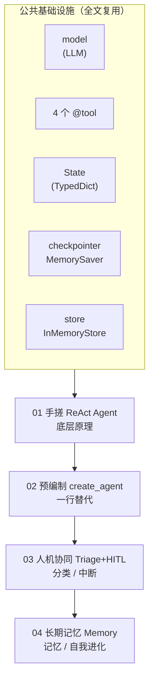
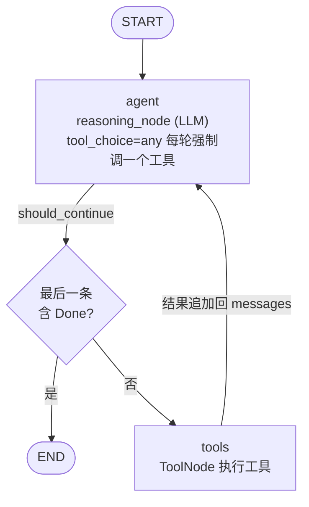
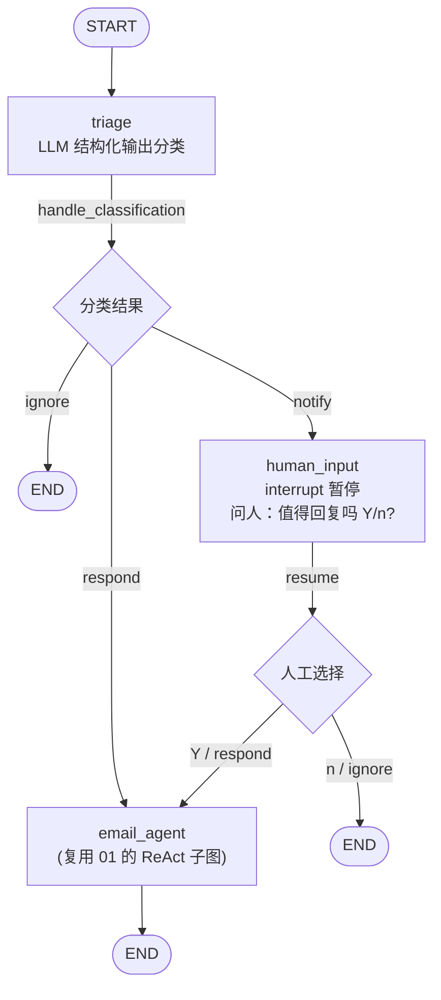
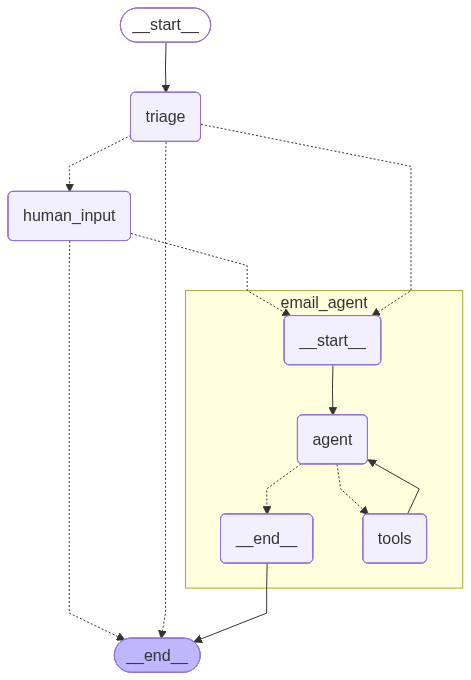
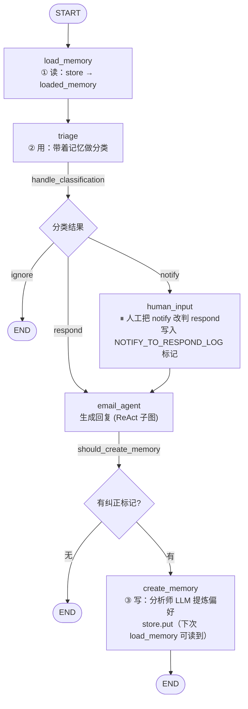
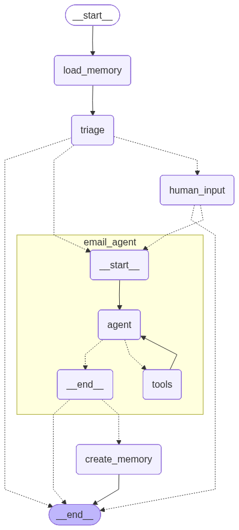
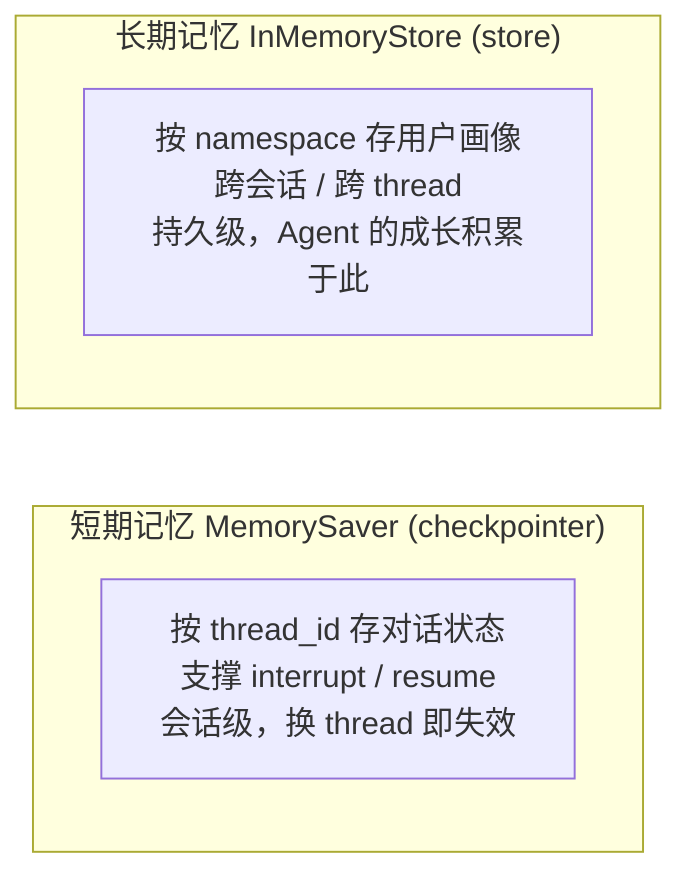
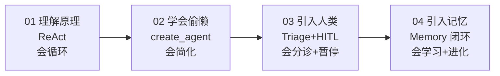

# email_agent.py 技术知识点总结

> 一个循序渐进的 LangGraph 邮件智能体教学示例：从手搓 ReAct Agent 一路进阶到「带长期记忆 + 人机协同」的自我进化工作流。
> 全文共 4 个部分，层层叠加、后者复用前者。

---

## 目录

- [全局架构总览](#全局架构总览)
- [第 01 部分：手搓 ReAct Agent](#第-01-部分手搓-react-agent)
- [第 02 部分：预编制 Agent](#第-02-部分预编制-agent)
- [第 03 部分：Human-in-the-Loop](#第-03-部分human-in-the-loop)
- [第 04 部分：Memory 长期记忆与自我进化](#第-04-部分memory-长期记忆与自我进化)
- [总结：设计主线与工程要点](#总结设计主线与工程要点)

---

## 全局架构总览

4 个部分是**层层叠加**的关系，后一部分复用前一部分的成果。



### 贯穿全文的 4 个核心组件（第 28-80 行）

| 组件 | 代码位置 | 作用 |
|------|---------|------|
| `InMemoryStore` | 第 28 行 | **长期记忆**（跨会话），存用户画像 |
| `MemorySaver` | 第 31 行 | **短期记忆 / checkpointer**，存对话状态，支撑断点续跑 |
| `State` (TypedDict) | 第 37-41 行 | 图的共享状态（黑板模式） |
| `tools` + `ToolNode` | 第 74-80 行 | 4 个工具及其执行节点 |

### State 设计（关键）

```python
class State(TypedDict):
    email_input: dict
    classification_decision: Literal["ignore", "respond", "notify"]
    messages: Annotated[list[AnyMessage], add_messages]  # reducer：追加而非覆盖
    loaded_memory: str
```

`messages` 使用了 `add_messages` 这个 **reducer**：各节点返回的消息被**追加**合并，而不是相互覆盖。这是多节点协作的基础。

---

## 第 01 部分：手搓 ReAct Agent

> 对应代码：第 33-250 行

### 知识点

不依赖任何高层封装，纯用 `StateGraph` 手工搭建经典的 **ReAct（Reason + Act）循环**，目的是理解 Agent 底层原理。

1. **工具定义的两种写法**（第 44-70 行）
   - `@tool` 装饰普通函数：`schedule_meeting` / `check_calendar_availability` / `write_email`
   - `@tool` 装饰 Pydantic `BaseModel`：`Done` —— 用一个「信号工具」让 LLM 自己声明「我做完了」，以此控制循环退出。
2. **强制工具调用**：`bind_tools(tools, tool_choice="any")`（第 77 行）—— 强制 LLM 每轮必须调一个工具，杜绝空转。
3. **条件路由 `should_continue`**（第 190-203 行）：检查最后一条消息，若含 `Done` 调用则 `END`，否则去 `tools`。做了**兜底**（无 tool_calls 时返回 END，避免返回 None 崩图）。
4. **防死循环**：`recursion_limit: 25`（第 229 行）—— LLM 若一直不调 `Done`，到达上限抛 `GraphRecursionError`。

### 架构图（ReAct 循环）



> LangGraph 实际导出图：


### 业务流程

输入一封「季度规划会议」邮件 → LLM 推理 → 调 `check_calendar_availability` 查空闲 → 调 `schedule_meeting` 定会 → 调 `write_email` 写回复 → 调 `Done` 结束。

---

## 第 02 部分：预编制 Agent

> 对应代码：第 253-335 行

### 知识点

**核心意图是对比**：第 01 部分手写了约 50 行图代码，这里用 `create_agent`（第 294-302 行）**一行替代**，得到功能等价的 Agent。

```python
email_prebuilt = create_agent(
    model=model, tools=tools, name="email_prebuilt",
    system_prompt=system_prompt_string,   # 不再需要手写 prompt 函数
    state_schema=State,
    checkpointer=checkpointer, store=in_memory_store
)
```

> LangGraph 实际导出图（create_agent 生成的标准 ReAct 结构）：


### 对比表

| 维度 | 01 手搓 | 02 预编制 |
|------|---------|-----------|
| 图的搭建 | 手写 node / edge / 路由 | 框架内置 |
| Prompt | 自定义函数拼装 | `system_prompt` 字符串 |
| 输入消息 | 节点内部构造 | 调用方传 `messages` |
| 灵活度 | 高（可插任意逻辑） | 低（标准 ReAct） |
| 代码量 | ~50 行 | ~10 行 |

**结论**：生产中优先用 `create_agent`；只有当你需要在循环里插入自定义节点（审核、日志等）时才手搓。两者底层都是同一套 ReAct 图。

---

## 第 03 部分：Human-in-the-Loop

> 对应代码：第 337-524 行

### 知识点

引入两大新能力：**邮件分类（Triage）** 和 **人工中断（HITL）**。Agent 不再来者不拒，而是先分诊。

1. **结构化输出路由**（第 341-354 行）：用 `RouterSchema`(Pydantic) + `with_structured_output`，强制 LLM 输出 `ignore / respond / notify` 三选一，并附 `reasoning`。
2. **`interrupt` 中断**（第 443 行）：在 `human_input` 节点用 `interrupt(...)` **暂停整个图**，把问题抛给人类，靠 `checkpointer` 保存现场。
3. **`Command(resume=...)` 恢复**（第 521 行）：人类回答后，用 `Command(resume="y")` 从断点继续。
4. **关键常量约定**（第 435 行）：`NOTIFY_TO_RESPOND_LOG` 标记字符串，在 `human_input` 写入、在第 04 部分 `should_create_memory` 读取——**两处必须用同一常量**，否则记忆永远不会触发。这是第 03→04 的伏笔。

### 业务流程图（三分诊 + 中断）



> LangGraph 实际导出图（xray 展开 email_agent 子图）：



**亮点**：`email_agent` 节点直接挂载了第 01 部分编译好的 `agent`（第 475 行 `add_node("email_agent", agent)`）—— **子图嵌套**，体现 LangGraph 的可组合性。

---

## 第 04 部分：Memory 长期记忆与自我进化

> 对应代码：第 526-694 行

### 知识点

最完整、最高阶的工作流：在 03 的基础上加了「读记忆 → 用记忆 → 写记忆」的闭环，让 Agent **从人类纠正中学习**。

1. **读记忆 `load_memory`**（第 543-550 行）：从 `store` 按 namespace `("memory_profile","Robert")` 取用户画像，注入 `state["loaded_memory"]`，再喂进 triage 的 prompt（第 406 行）。
2. **记忆数据模型 `UserProfile`**（第 554-557 行）：结构化存 `response_preferences` 偏好列表。
3. **写记忆 `create_memory`**（第 595-614 行）：用一个**专门的「分析师」LLM**（`create_memory_prompt`）复盘整段对话，提炼/更新用户偏好，`store.put` 持久化。
4. **触发条件 `should_create_memory`**（第 618-625 行）：**只有当人类把 notify 改判为 respond 时才学习**——检测 messages 里是否含 `NOTIFY_TO_RESPOND_LOG` 标记（呼应第 03 的伏笔）。这是一种「从纠正中学习」的精妙设计。

### 完整架构图（记忆闭环）



> LangGraph 实际导出图（xray 展开 email_agent 子图，含 create_memory 记忆闭环）：



### 记忆双轨架构



---

## 总结：设计主线与工程要点

### 演进主线



### 最值得记住的 5 个工程要点

1. **`add_messages` reducer** —— 状态累加，是多节点协作的基础。
2. **`Done` 信号工具 + `tool_choice="any"` + `recursion_limit`** —— 三件套控制 Agent 循环的进与退。
3. **`with_structured_output(Pydantic)`** —— 让 LLM 做可靠的分类/抽取决策。
4. **`interrupt` + `Command(resume)` + checkpointer** —— 人机协同的标准范式。
5. **双记忆体系（checkpointer 短期 / store 长期）+ 从纠正中学习** —— 让 Agent 具备进化能力。

---

## 附：用 LangGraph 导出真实流程图

本目录（`201/docs/`）的 4 张 PNG（`image/` 下）由同目录的 `export_graphs.py` 生成。它按原文件 `email_agent.py` **完全一致的拓扑**重建 4 张图、节点用占位实现，**全程零 LLM 调用、零 API 费用**：

```bash
# 在 notebooks/ 下运行
python 201/docs/export_graphs.py   # 输出到 201/docs/image/01~04_*.png
```

核心 API —— 每个编译后的图对象都可导出 Mermaid PNG：

```python
# 任选一个编译好的图：agent / email_prebuilt / email_hitl / email_agent_memory
png_bytes = email_agent_memory.get_graph(xray=True).draw_mermaid_png()
with open("image/04_email_agent_memory.png", "wb") as f:
    f.write(png_bytes)

# 或直接打印 mermaid 源码
print(email_agent_memory.get_graph(xray=True).draw_mermaid())
```

> - `xray=True` 会把 `email_agent` 这种**子图**展开，画出内部的 agent↔tools 循环。
> - `draw_mermaid_png()` 走 `mermaid.ink` 远程渲染，偶发网络抖动重试即可；脚本已内置失败回退（导出 `.mmd` 源码）。
