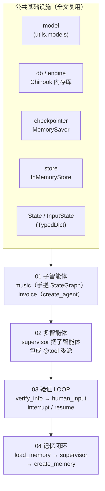
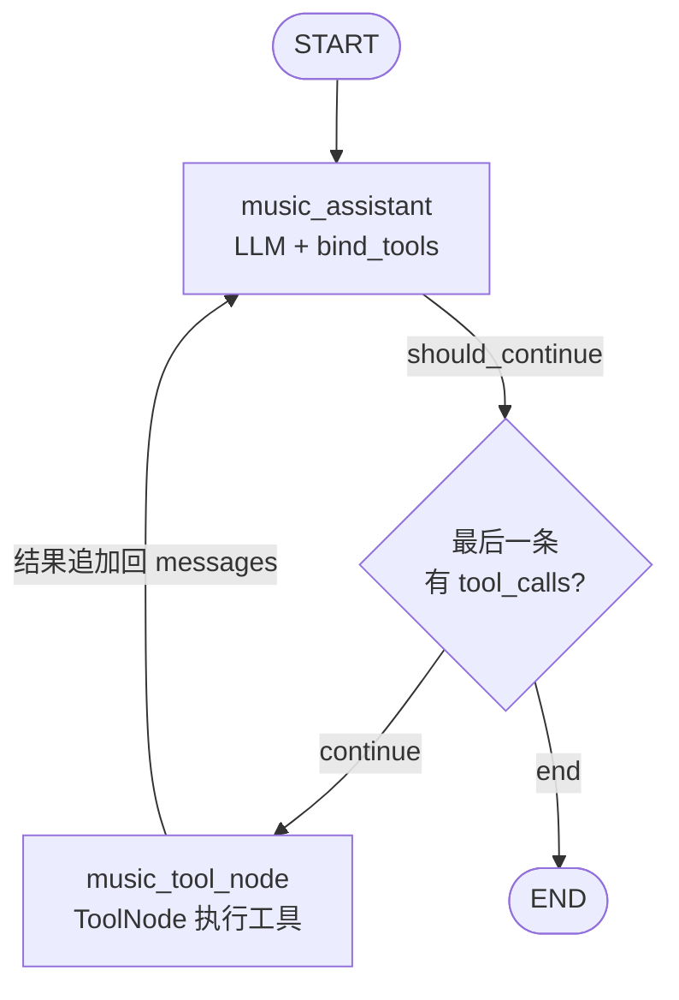
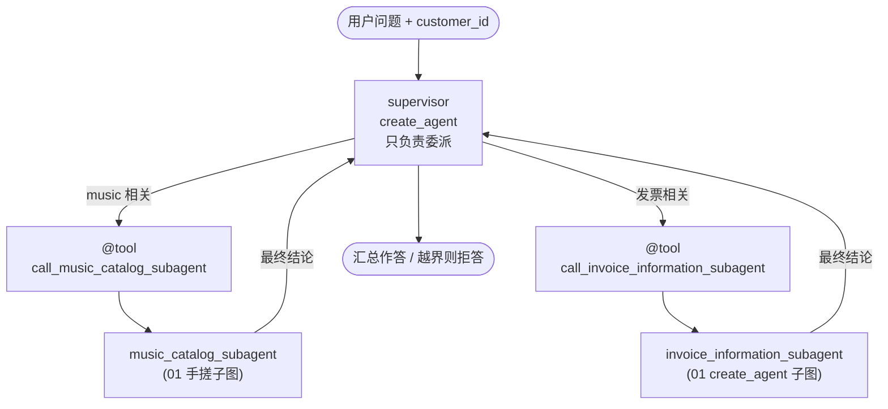
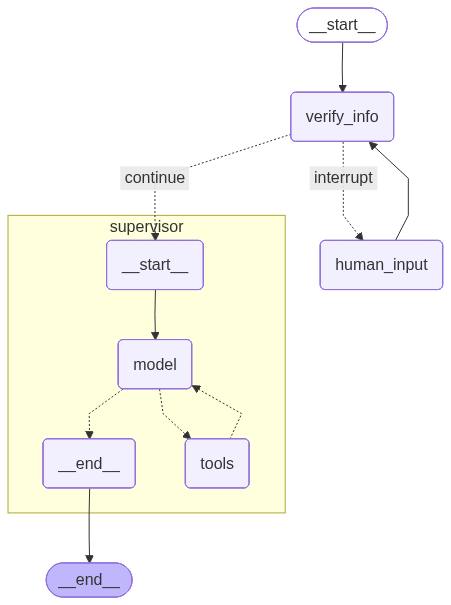
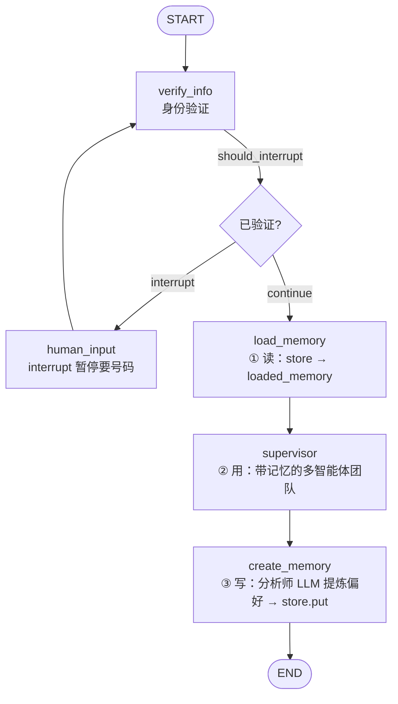
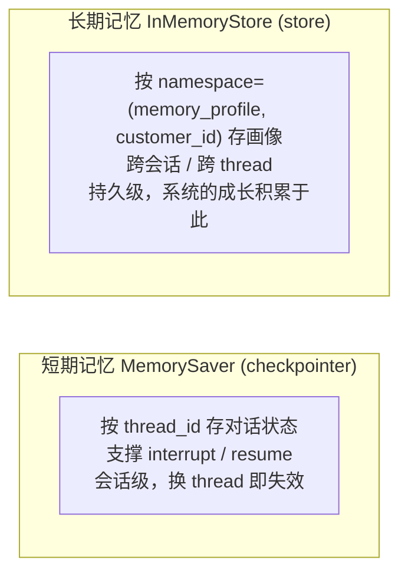
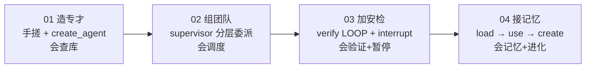

# multi_agent.py 技术知识点总结

> 一个循序渐进的 LangGraph **多智能体（multi-agent）** 教学示例：从手搓子智能体 → `create_agent` 预编制子智能体 → supervisor 分层委派 → 「身份验证 + 人机协同」LOOP → 「长期记忆 + 自我进化」的完整客服系统。
> 全文共 4 个有效部分（05 为空占位），层层叠加、后者复用前者，最终拼出一个数字音乐商店的客户支持多智能体工作流。

---

## 目录

- [全局架构总览](#全局架构总览)
- [第 01 部分：构建子智能体（手搓 vs create_agent）](#第-01-部分构建子智能体手搓-vs-create_agent)
- [第 02 部分：构建多智能体架构（Supervisor 分层委派）](#第-02-部分构建多智能体架构supervisor-分层委派)
- [第 03 部分：添加用户验证 LOOP（身份校验 + 人机协同）](#第-03-部分添加用户验证-loop身份校验--人机协同)
- [第 04 部分：添加记忆（长期记忆与自我进化）](#第-04-部分添加记忆长期记忆与自我进化)
- [总结：设计主线与工程要点](#总结设计主线与工程要点)
- [附：用 LangGraph 导出真实流程图](#附用-langgraph-导出真实流程图)

---

## 全局架构总览

4 个部分是**层层叠加**的关系：先造两个「干活的」子智能体（01），再用 supervisor 把它们组成团队（02），然后在团队前面加一道「身份验证 + 中断」关卡（03），最后给整条流程接上「读记忆 → 用记忆 → 写记忆」的闭环（04）。



### 贯穿全文的核心组件

| 组件 | 代码位置（行） | 作用 |
|------|---------|------|
| `model` | 第 29 行（`from utils.models import model`） | 统一的 LLM 入口，全文复用，不在业务文件硬编码密钥 |
| `engine` / `db` | 第 51-52 行 | 拉取 Chinook SQL 灌进 SQLite 内存库，所有 `@tool` 的数据源 |
| `InMemoryStore` | 第 55 行 | **长期记忆**（跨会话），存用户音乐偏好画像 |
| `MemorySaver` | 第 58 行 | **短期记忆 / checkpointer**，存对话状态，支撑 `interrupt` 断点续跑 |
| `InputState` / `State` | 第 65-73 行 | 图的输入契约与共享状态（黑板模式） |
| 各 `@tool` | 第 77-142、254-313 行 | 音乐 4 工具 + 发票 3 工具，子智能体的「手脚」 |

### State 设计（关键）

```python
class InputState(TypedDict):
    messages: Annotated[List[AnyMessage], add_messages]  # reducer：追加而非覆盖


class State(InputState):
    customer_id: int        # 身份验证后写入，工具靠它查私有数据
    loaded_memory: str      # 04 部分从 store 读出的用户偏好
    remaining_steps: int    # create_agent 用于步数控制
```

- `messages` 使用 `add_messages` 这个 **reducer**：各节点返回的消息被**追加**合并而非覆盖，是多节点 / 多智能体协作的基础。
- `State` **继承自** `InputState`：对外只暴露 `messages`（`input_schema=InputState`），`customer_id` / `loaded_memory` 等是图内部状态，不要求调用方传入——这正是工具能「看不见 customer_id 却用得到它」的原因。

> ⚠️ 风格提示：第 6 行用了 `from typing import ... List`，而项目规范（CLAUDE.md）推荐内建泛型 `list[...]`。教学沿用无妨，新代码建议统一为 `list`。

---

## 第 01 部分：构建子智能体（手搓 vs create_agent）

> 对应代码：第 60-370 行（含 `01` 与 `01-1.2` 两个分段）

本部分造出两个「专才」子智能体，并刻意用**两种不同写法**，形成对比。

### 知识点

1. **数据源：把 Chinook 灌进内存 SQLite**（第 33-52 行）
   `get_engine_for_chinook_db()` 用 `requests` 拉取远程 `.sql`，`sqlite3.connect(":memory:")` + `executescript` 灌库，再用 `StaticPool` + `creator=lambda: connection` 让 SQLAlchemy **复用同一条连接**（内存库换连接即丢数据，这是必须 StaticPool 的原因）。最后包成 `SQLDatabase(db)` 供 `db.run(...)` 调用。

2. **手搓子智能体 `music_catalog_subagent`**（第 64-236 行）——经典 ReAct 循环
   - 4 个 `@tool`：`get_albums_by_artist` / `get_tracks_by_artist` / `get_song_by_genre` / `check_for_songs`（第 77-142 行）。
   - `llm_with_music_tools = model.bind_tools(music_tools)`（第 147 行）+ `music_tool_node = ToolNode(music_tools)`（第 150 行）。
   - `generate_music_assistant_prompt(memory)`（第 154-190 行）：**返回字符串的函数式提示词**，把 `loaded_memory` 注入进去，为 04 部分的记忆复用埋下伏笔。
   - `music_assistant` 节点（第 194-202 行）：`if "loaded_memory" in state` 做兜底，没记忆时用 `"None"`。
   - 条件路由 `should_continue`（第 206-212 行）：看最后一条消息有无 `tool_calls`，有则 `"continue"`→工具节点，无则 `"end"`→END。
   - 构图顺序规范：`add_node` → `add_edge(START,...)` → `add_conditional_edges` → `add_edge(tool→assistant)` → `compile`（第 216-236 行），形成 `assistant ↔ tool_node` 的 ReAct 环。

3. **预编制子智能体 `invoice_information_subagent`**（第 254-354 行）——一行替代
   - 3 个发票 `@tool` 通过 `runtime: ToolRuntime` 访问 `runtime.state.get("customer_id")`（第 262、277、301 行），**客户 ID 不出现在消息历史里**，由状态注入，安全且省 token。
   - 直接 `create_agent(model=..., tools=..., state_schema=State, checkpointer=..., store=...)`（第 346-354 行）得到等价 ReAct Agent，无需手写图。
   - 调用时传 `customer_id`（第 360 行），工具才能查到对应发票。

> ⚠️ 可疑写法：`runtime.state.get("customer_id", {})`（第 262/277/301/407 行）给整数字段用 `{}` 兜底，类型不一致，更合理的默认是 `None`。教学不影响演示，生产应修正。

### 两种写法对比

| 维度 | 手搓 `music_catalog_subagent` | 预编制 `invoice_information_subagent` |
|------|------|------|
| 图的搭建 | 手写 node / edge / 路由 | `create_agent` 内置 |
| Prompt | 函数式（可注入记忆） | `system_prompt` 字符串 |
| 灵活度 | 高（可插自定义节点） | 低（标准 ReAct） |
| 代码量 | ~50 行 | ~10 行 |
| 本例用途 | 需要把 `loaded_memory` 注入 prompt | 纯查库即可 |

### 架构图（手搓音乐子智能体的 ReAct 环）



---

## 第 02 部分：构建多智能体架构（Supervisor 分层委派）

> 对应代码：第 372-453 行

### 知识点

核心是 **「智能体即工具」（agent-as-tool）** 的分层模式：把 01 造好的两个子智能体各自包成一个 `@tool`，交给一个 supervisor 决定调谁。

1. **把子智能体包成 `@tool`**（第 402-421 行）
   - `@tool(name_or_callable="invoice_information_subagent", description=...)`：工具名与 description 直接决定 supervisor 的路由准确度，**必须写清职责边界**。
   - `call_invoice_information_subagent` 内部把 `runtime.state.get("customer_id")` 透传给发票子智能体（第 404-410 行），保证私有数据可查。
   - `call_music_catalog_subagent` 不需要 customer_id，签名更简单（第 416-421 行）。
   - 两个包装工具都只回传 `result["messages"][-1].content`——**只把子智能体的最终结论交还**给 supervisor，屏蔽中间过程。

2. **Supervisor 提示词**（第 375-398 行）：用 `<背景>` / `<重要指示>` / `<工具>` 分段，明确「只委派、不亲自答」「越界问题礼貌拒绝」。

3. **构建 supervisor**（第 425-433 行）：又是 `create_agent`，工具列表是那两个包装工具，`state_schema=State` 让 customer_id 能在 supervisor 与子智能体间流转。

4. **越界测试**（第 437 行）：故意问「我最喜欢的水果是什么？」用来验证 supervisor 会**拒答工作范围外**的问题（呼应提示词里的护栏），而不是乱调工具。

### 架构图（分层委派）



### 对比：扁平 ReAct vs 分层多智能体

| 维度 | 单 Agent（多工具堆一起） | Supervisor 多智能体 |
|------|------|------|
| 工具数量 | 全部塞给一个 LLM | 按域拆给子智能体 |
| 提示词 | 又长又杂 | 各司其职、短而专 |
| 可维护性 | 加一个域要改主 prompt | 加一个子智能体 + 一个包装工具 |
| 上下文 | 易超长、易串味 | 子智能体内部上下文隔离 |

---

## 第 03 部分：添加用户验证 LOOP（身份校验 + 人机协同）

> 对应代码：第 455-579 行

### 知识点

在 supervisor 团队**前面加一道安检**：没验证身份前，绝不进入业务流程。这一部分把 `interrupt` / `Command(resume)` / 条件回环用了个齐全。

1. **结构化抽取手机号**（第 464-472 行）
   `PhoneNumberExtraction(BaseModel)` + `Field(description=...)` + `model.with_structured_output(...)`，强制 LLM 从对话里抽出 `phone_number`（未提供则空串）。docstring 与 Field description 都会进 schema，写得越具体抽得越准。

2. **`verify_info` 节点：验证核心**（第 478-515 行）
   - `customer_id` 已存在 → 直接 `return`（隐式 None，LangGraph 视为「无状态更新」，安全放行）。
   - 否则抽手机号 → 查库匹配 `customer_id` → 用 `ast.literal_eval` 解析结果并 `try/except (ValueError, SyntaxError)` **兜底**（第 491-495 行，符合「捕获具体异常」规范）。
   - 验证成功写入 `customer_id` + 一条确认 `AIMessage`；失败则让 LLM 用「安检员」提示词（第 504-512 行）礼貌索要 / 纠正号码。

3. **`human_input`：中断节点**（第 519-522 行）
   空操作节点，靠 `interrupt("请提供输入。")` **暂停整张图**，把控制权交还人类，现场由 checkpointer 保存。

4. **`should_interrupt` 路由**（第 526-530 行）：`customer_id is not None` → `"continue"`（去 supervisor）；否则 `"interrupt"`（去 human_input）。

5. **验证 LOOP 拓扑**（第 542-549 行）：`verify_info` ⇄ `human_input` 形成**回环**——用户给错号码会被反复要求，直到验证通过才放行 supervisor。

6. **`Command(resume=...)` 恢复**（第 568 行）：人类补上手机号后，用 `Command(resume="...")` 从断点继续，**复用同一个 thread_id 的 config**（第 557 行）才能命中检查点。

### 业务流程图（验证回环 + 中断）

```mermaid
flowchart TD
    START([START]) --> V["verify_info<br/>抽手机号 → 查库 → 写 customer_id"]
    V -->|should_interrupt| C{"customer_id<br/>已验证?"}
    C -->|interrupt| HI["human_input<br/>interrupt 暂停<br/>问用户要手机号"]
    C -->|continue| SUP["supervisor<br/>(02 多智能体团队)"]
    HI -->|Command(resume)| V
    SUP --> END([END])
```

> LangGraph 实际导出图（由 `export_verify_loop.py` 生成）：



---

## 第 04 部分：添加记忆（长期记忆与自我进化）

> 对应代码：第 581-703 行

### 知识点

在 03 的验证流程上，再接「读记忆 → 用记忆 → 写记忆」的闭环，让系统**跨会话记住用户的音乐偏好**。

1. **读记忆 `load_memory`**（第 596-604 行）
   按 namespace `("memory_profile", user_id)` 从 `store` 取 `"user_memory"`，经 `format_user_memory` 提炼成字符串写入 `state["loaded_memory"]`——这正是 01 部分 `generate_music_assistant_prompt(memory)` 等着接收的入参，伏笔在此回收。

2. **记忆格式化兜底 `format_user_memory`**（第 586-592 行）
   用 `hasattr(profile, "music_preferences")` 防御性判断，空档案不报错，返回空串。

3. **记忆数据模型 `UserProfile`**（第 608-614 行）
   `customer_id` + `music_preferences` 两字段，配 `Field(description=...)` 供结构化输出使用。

4. **写记忆 `create_memory`**（第 654-663 行）
   用**专门的「分析师」LLM**（`create_memory_prompt`，第 617-650 行）复盘整段 `messages`，`with_structured_output(UserProfile)` 提炼/更新偏好，`store.put(namespace, "user_memory", {"memory": ...})` 持久化。提示词里强调「无新信息就保持原值」，避免覆盖式遗忘。

5. **完整拓扑**（第 667-692 行）：在 03 的回环基础上，把放行后的链路改成 `load_memory → supervisor → create_memory → END`——**每轮对话结束都沉淀一次记忆**，下一会话 `load_memory` 即可读到，形成自我进化闭环。

> ⚠️ 注意：本部分编译出的 `multi_agent_final_graph` 调了 `show_graph(...)`（第 693 行）但**目前 docs/image 下没有对应 PNG**；如需补图，可仿照 `export_verify_loop.py` 写一份 04 的占位导出脚本（详见文末）。

### 完整架构图（记忆闭环）



### 记忆双轨架构



---

## 总结：设计主线与工程要点

### 演进主线



### 最值得记住的 6 个工程要点

1. **`add_messages` reducer + `State(InputState)` 继承** —— 对外只暴露 `messages`，`customer_id` 等内部状态由图自己维护，是「工具看不见却用得到 customer_id」的关键。
2. **两种子智能体写法** —— 需要往 prompt 注入动态内容（如记忆）就手搓 `StateGraph`；纯标准 ReAct 就 `create_agent` 一行搞定。
3. **agent-as-tool 分层委派** —— 把子智能体包成 `@tool`，supervisor 只负责路由；`@tool` 的 name/description 直接决定调度准确率。
4. **`ToolRuntime` + `runtime.state` 注入私有参数** —— 敏感的 customer_id 不进消息历史，既安全又省 token（但别用 `{}` 给整数兜底）。
5. **`interrupt` + `Command(resume)` + 回环边 + checkpointer** —— 人机协同的标准范式；验证不通过就 `verify_info ⇄ human_input` 反复，直到放行。
6. **双记忆体系 + 每轮 `create_memory`** —— checkpointer 管会话内续跑，store 管跨会话画像，让系统具备进化能力。

### 教学代码中需留意的工程隐患

- **SQL 注入**：第 81/96/113/142/263/488 等多处用 f-string 拼接 SQL（如 `WHERE Name LIKE '%{...}%'`、`Phone='{identifier}'`），生产环境必须改参数化查询。
- **import 与类型注解**：第 1-23 行三组 import 有交叉（`requests` 混进第三方区、`notebooks.utils` 在 `sys.path` 注入前导入）；第 6 行 `List` 建议改 `list`；`format_user_memory` / 部分 `@tool` 缺类型注解与完整 docstring。
- **第 04 部分缺导出图**：`multi_agent_final_graph` 尚无 PNG。

---

## 附：用 LangGraph 导出真实流程图

本目录（`201/docs/`）的 `03_multi_agent_verify_loop.png` 由同目录 `export_verify_loop.py` 生成。它按 `multi_agent.py:542-549` **完全一致的拓扑**用占位节点重建图，**全程零 LLM 调用、零 API 费用**：

```bash
# 在 notebooks/201/docs/ 下运行
python export_verify_loop.py   # 输出到 image/03_multi_agent_verify_loop.png
```

核心 API —— 每个编译后的图对象都能导出 Mermaid PNG：

```python
# graph = multi_agent_verify.compile(name="multi_agent_verify")
png_bytes = graph.get_graph().draw_mermaid_png()
with open("image/03_multi_agent_verify_loop.png", "wb") as f:
    f.write(png_bytes)

# 或直接打印 mermaid / ascii 源码（离线兜底）
print(graph.get_graph().draw_mermaid())
print(graph.get_graph().draw_ascii())
```

> 若要补出第 04 部分 `multi_agent_final`（含 `load_memory` / `create_memory`）的真实图，复制 `export_verify_loop.py`，把节点占位补成 `verify_info / human_input / load_memory / supervisor / create_memory` 五个，按 `multi_agent.py:677-688` 的边重建，再 `draw_mermaid_png()` 即可，命名建议 `04_multi_agent_final.png`。
