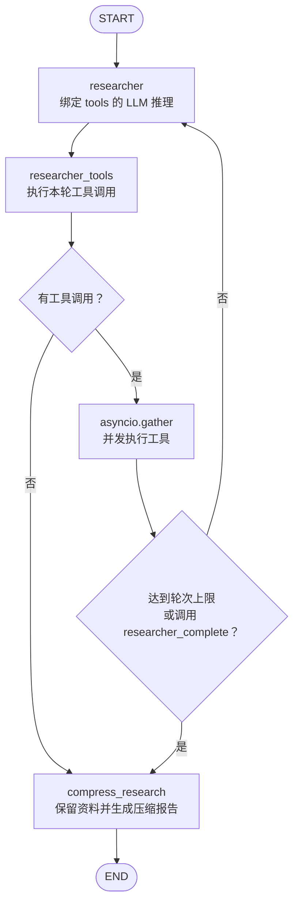
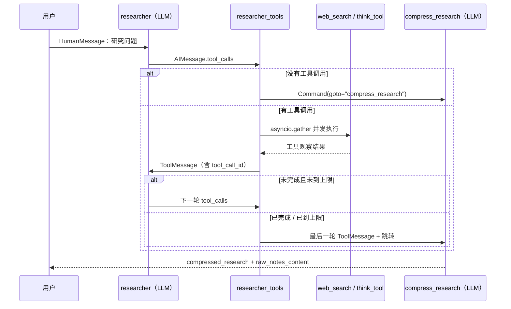
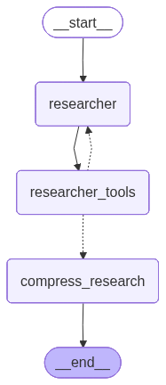
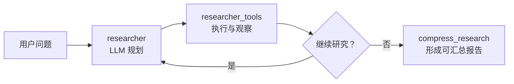

# research_agent_03.py 技术知识点总结

> 一个手工搭建的 LangGraph 单研究员（single researcher）示例：LLM 规划研究、调用联网与反思工具、循环补充资料，最后压缩为带来源的研究笔记。
> 本章共 1 个部分，重点不是搜索本身，而是理解 ReAct 循环、消息 reducer、`Command` 动态路由与工程边界控制。

---

## 目录

- [学习检测评分（前 8 题）](#学习检测评分前-8-题)
- [全局架构总览](#全局架构总览)
- [第 01 部分：构建一个单例搜索 Agent](#第-01-部分构建一个单例搜索-agent)
- [总结：设计主线与工程要点](#总结设计主线与工程要点)
- [附：用 LangGraph 导出真实流程图](#附用-langgraph-导出真实流程图)

---

## 学习检测评分（前 8 题）

评分侧重两件事：能否讲清概念，以及能否据此安全地阅读或修改本章代码。每题 10 分，总分 80 分。

| 题目 | 考查点 | 得分 | 评价与待巩固点 |
|---|---|---:|---|
| 1 | 三节点工作流与退出条件 | 8 | 正确识别 `researcher → researcher_tools → compress_research` 的循环。需区分“无工具调用”“显式 `researcher_complete`”“达到代码上限”三种结束路径。 |
| 2 | `operator.add` reducer | 8 | 理解了消息历史需要叠加。需记住：不写 reducer 不一定报错，但默认会覆盖旧列表，导致循环失去上下文。 |
| 3 | 工具调用、并发与 `ToolMessage` | 8 | 已掌握 `bind_tools`、并发和 ID 的核心作用。需纠正：工具 `name` 可重复，真正关联某一次调用与其结果的是 `tool_call_id`。 |
| 4 | 两类压缩路由 | 8 | 正确区分“未调用工具”与“完成/上限”。还要牢记第二条路径写入 `tool_outputs` 是为了不遗漏刚执行完的最后一轮资料。 |
| 5 | 提示词预算与代码预算 | 7 | 正确看到提示词的 4 次搜索与常量的 10 次限制不一致。关键补充：现有计数器统计的是 `researcher` 推理轮次，不是工具调用次数。 |
| 6 | 状态原地修改风险 | 7 | 正确理解压缩指令会加入模型上下文。需进一步警惕 `append()` 修改了从 `state` 取出的原列表，产生未在返回值中声明的状态副作用。 |
| 7 | 内部 State 与输出 schema | 9 | 准确区分了运行状态和最终输出。`researcher_topic`、计数器是流程内部字段，不必暴露给调用方。 |
| 8 | `Command` 的路由和更新 | 7 | 已理解 `goto` 决定下一跳。还需牢记 `update` 负责把工具结果写回状态，并由 reducer 合并。 |

**总分：62 / 80（77.5 分）**

你的主干理解已经可靠：知道这是循环 Agent、知道状态消息要累积、知道工具结果必须回传模型。下一阶段应重点练习“代码实际行为”和“注释/提示词宣称的行为”是否一致；这正是从会使用框架走向能审查 Agent 工程的分界线。

---

## 全局架构总览

本章是一个自定义 ReAct 研究循环。`researcher` 负责让 LLM 决定下一步，`researcher_tools` 把决定落实为工具执行并动态路由，`compress_research` 在循环结束后整理研究资料。



### 贯穿本章的核心组件

| 组件 | 代码位置 | 作用 |
|---|---|---|
| `web_search` | 第 58-83 行 | 将千问内置联网能力包装为 LangChain 异步工具，返回带来源的搜索结果。 |
| `researcher_complete` / `think_tool` | 第 136-156 行 | 前者是模型声明完成的信号工具，后者用于记录每次搜索后的反思。 |
| `ResearcherState` | 第 116-121 行 | 图的内部共享状态：消息历史、研究主题、推理轮次。 |
| `operator.add` | 第 119 行 | `researcher_messages` 的 reducer，确保循环中每轮新消息追加而非覆盖。 |
| `researcher` | 第 207-235 行 | 组织 prompt、绑定工具、调用 LLM 并记录本轮 AI 回复。 |
| `researcher_tools` | 第 261-327 行 | 并发执行工具、转换为 `ToolMessage`、用 `Command` 路由。 |
| `compress_research` | 第 348-374 行 | 将研究过程压缩为报告，同时产出原始笔记。 |
| `StateGraph` | 第 378-389 行 | 注册节点和静态边；`Command` 补充运行时的动态边。 |

### State 设计（关键）

```python
class ResearcherState(TypedDict):
    researcher_messages: Annotated[
        list[MessageLikeRepresentation], operator.add
    ]
    researcher_topic: str
    tool_call_iterations: int
```

`researcher_messages` 不是普通列表字段，而是使用 `operator.add` 作为 reducer：节点返回的 `AIMessage` 与 `ToolMessage` 会追加到历史消息。没有它时，新的列表会覆盖历史，下一轮 LLM 既看不到用户问题，也看不到工具观察结果，ReAct 循环无法成立。

---

## 第 01 部分：构建一个单例搜索 Agent

> 对应代码：第 29-411 行

### 知识点

1. **把供应商联网能力封装成普通工具**（第 58-83 行）
   - `web_search` 内部以 `bind(extra_body=...)` 临时开启千问搜索，再以 `ainvoke()` 异步调用。
   - 外层研究 Agent 不需要了解供应商参数，只把它当作名为 `web_search` 的工具。这种分层让“研究策略”和“检索实现”解耦。

2. **工具 schema 是 LLM 的可用能力说明书**（第 136-165 行）
   - `@tool` 的 description 和函数 docstring 会进入工具 schema，因此 `researcher_complete` 的价值不在业务计算，而在提供一个明确、可被模型调用的结束信号。
   - `think_tool` 要求模型在搜索后反思；但这只是提示词约束，代码并未验证“每次搜索后一定调用了它”。关键质量约束应在代码层再做校验。

3. **ReAct 节点把“思考”和“行动”分开**（第 207-235、261-327 行）
   - `researcher` 调用 `get_model().bind_tools(tools)`，得到允许产生结构化 `tool_calls` 的模型回复。
   - `researcher_tools` 不再调用 LLM，而是读取最新 `AIMessage.tool_calls`、执行工具、追加 `ToolMessage`。下一轮回到 `researcher` 时，LLM 才能依据观察结果继续决策。

4. **并发工具执行与调用关联**（第 282-309 行）
   - 本轮每个调用都会形成一个协程，`asyncio.gather(*tool_execution_tasks)` 并发等待，适合互不依赖的多次网络搜索。
   - `tools_by_name` 用工具名定位工具定义；`tool_call_id` 用于关联某一次具体调用和它的结果。工具名可以重复，例如模型可以同一轮两次调用 `web_search`。
   - `zip(..., strict=True)` 确保观察结果与原调用数量不一致时立即报错，避免静默错配。

5. **`Command` 同时做路由与状态更新**（第 279-327 行）
   - 没有工具调用时，`Command(goto="compress_research")` 直接结束循环。
   - 有工具调用时，工具结果通过 `update={"researcher_messages": tool_outputs}` 写回状态；因为 reducer 是 `operator.add`，结果追加到对话历史。
   - 若模型调用了 `researcher_complete` 或代码认定超出上限，仍须先写入最后一轮 `tool_outputs`，否则压缩节点会遗漏最新资料。

6. **输入 schema 与输出 schema 分离**（第 116-130、378 行）
   - `ResearcherState` 是运行时完整状态，包含 `researcher_topic` 和 `tool_call_iterations` 等内部控制字段。
   - `ResearcherOutputState` 是最终返回契约，仅暴露消息、压缩报告、原始笔记；调用方不需要依赖内部计数器，接口更稳定。

7. **压缩阶段要保留可追溯原料**（第 331-374 行）
   - `compressed_research` 面向后续汇总模型，要求保留相关信息及来源；`raw_notes_content` 则保留 AI 和工具消息的文本，便于调试和复核。
   - “逐字保留”是 LLM 指令，不是技术保证；如果要求严格可审计的原文，应把原始搜索结果作为结构化数据保存，而不只依赖模型压缩。

### Agent 业务流程



> LangGraph 实际导出图：



### 本章值得主动检测的工程问题

| 位置 | 现状 | 风险 | 改进方向 |
|---|---|---|---|
| 第 30-32 行 | 定义了 3 个常量，但只有 `MAX_REACT_TOOL_CALLS` 被使用 | 未使用常量会误导读者，以为存在 supervisor 或并发研究单元控制。 | 删除未使用常量，或在上层 supervisor 图中真正接入。 |
| 第 194-197 行 vs 第 234、311-313 行 | Prompt 说“搜索最多 4 次”，代码阈值是 10 | 两个预算不一致；更重要的是计数器每次 `researcher` 推理加一，并不统计搜索次数。 | State 增加 `web_search_count`，按实际 `web_search` 调用数强制限制 4 次；推理轮次另设 `MAX_REACT_ITERATIONS`。 |
| 第 275-280 行 | `has_native_search` 由 `response.tool_calls` 推导 | 只要 `has_native_search` 为真，`has_tool_calls` 必然也为真，因此该条件冗余。 | 若无额外协议字段，可直接判断 `if not has_tool_calls:`。 |
| 第 252-256 行 | 捕获宽泛的 `Exception` | 能避免单工具中断全局，但会把程序错误也伪装成可恢复工具错误。 | 优先捕获预期的网络、超时、校验异常；未知异常记录并按策略上抛。 |
| 第 357-358 行 | 对从 `state` 取得的列表直接 `append()` | 可能原地改变图状态，形成未通过返回值声明的副作用。 | 先用 `list(state.get("researcher_messages", []))` 复制，再追加压缩提示。 |
| 第 364 行 | `await  get_model()` 有两个空格 | 不影响执行，但不符合项目排版规范。 | 格式化为一个空格。 |

---

## 总结：设计主线与工程要点

### 演进主线



### 最值得记住的 6 个工程要点

1. **ReAct 的最小闭环是 `AIMessage.tool_calls → ToolMessage → 下一轮 LLM`**。少了工具观察结果，模型无法基于事实继续推理。
2. **reducer 决定状态如何演进**。`operator.add` 让消息历史可累积；默认覆盖会破坏多轮上下文。
3. **`Command` 是动态控制流的核心**。它把“下一跳去哪”和“状态新增什么”放在同一个原子返回中。
4. **工具定义和工具调用要分清**。`name` 选中工具定义，`tool_call_id` 关联某一次调用和对应结果。
5. **提示词是软约束，状态与路由才是硬约束**。搜索次数、反思步骤、停止条件若重要，就必须有可验证的状态字段和程序判断。
6. **避免原地修改 State**。节点应通过返回值描述状态变化，局部构造的消息列表应复制后再修改，这样才容易调试和组合。

---

## 附：用 LangGraph 导出真实流程图

本目录已有 [`export_research_agent.py`](export_research_agent.py)，以占位节点重建与本章一致的图拓扑，因此导图不会调用 LLM 或联网。

```bash
# 在 notebooks/201/docs/ 目录运行
python export_research_agent.py
```

核心 API 是：

```python
png_bytes = researcher_graph.get_graph().draw_mermaid_png()
with open("image/05_researcher.png", "wb") as file:
    file.write(png_bytes)

print(researcher_graph.get_graph().draw_mermaid())
```

`researcher_tools` 返回类型中的 `Command[Literal["researcher", "compress_research"]]` 会把两条动态跳转关系提供给 LangGraph 的图分析能力，因此流程图可以呈现 ReAct 回环和压缩出口。
